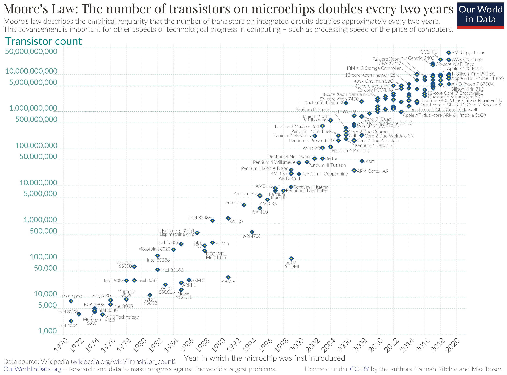

<!-- headingDivider: 3 -->

# **Introduction to Chip Design**

**Martin Schoeberl and Luca Pezzarossa**

## Welcome

 * Learn the basics of chip cesign
 * Design and fabricate your own chip (ASIC)
 * We will use open-source tools only
 * This is a new 13 weeks course
    * We will adapt to your needs and interests
    * We did an open-source chipdesign course as special course before
 * Will have rough edges
 * I am exciting to see you building your own chips

## Introduction Round

 * Who we are?
   - Luca and Martin
 * Who are you?
   - Why this course?
   - What is your background?

## Course Overview

 * Some initial lectures, including labs
 * Guest lectures
 * Project work
   - Pick a topic and work in groups
   - Design and tapeout a chip
     - By combining projects
     - Chip design is a large team effort
   - Use the Tiny Tapeout platform (and/or efabless)
   - Write a (short) report

## Moore's Law: the Exponential Growth

 * Number of transistors on a chip doubles every 2 years
 * Predicted by Gordon Moore in 1965 (Intel co-founder)
   * Still holds, but not for free
   * Transistors are getting smaller
   * Power density is increasing
   * 7 nm technology node is common now
     - x nm was originally gate length, but not anymore
   * When is the end of Moore's Law?
 * [Moor's Law](https://en.wikipedia.org/wiki/Moore%27s_law)

---

## Dennard Scaling

 * Transistor size shrinks
   * Voltage scales down
   * Current scales down
   * Power density stays constant
 * Power stays proportional with area
 * No more Dennard scaling
   * Leakage current increases with smaller transistors

## Trends in Chip Design

 * Processors performance gains are slowing down
 * More specialized cores (e.g, AI accelerators)
 * More digital/ASIC designes needed
 * We need 20+ new chip designers per year in Denmark/Copenhagen
 * Bright future for you!

## Open Source Chip Design

 * Open source tools (OpenLane)
 * Open source PDK (SkyWater130)
 * Open source IP (e.g., RISC-V core Wildcat)
 * Open source chip framework (Caravell from efabless)
 * Open source teaching material (this course)

## Tools

 * Chisel
 * Verilog/Verilator
 * Yosys
 * OpenRoad and OpenLane
 * SkyWater PDK

## The Flow (very generic)

 * RTL design
 * Synthesis
 * Place and route
 * Tapeout
 * Manufacturing (in the fab)
 * Testing
 * Bring-up

## OpenLane

 * OpenLane is an open-source digital ASIC flow
 * RTL to GDSII flow
   - GDSII is the final layout file for the chip
   - Sent to the foundry (short fab) for manufacturing 
 * Based on several open-source tools
 * Developed by efabless
 * Resuses OpenROAD and Yosys
 * We will explore OpenLane today!

## OpenRoad

 * Fully autonomous, no-human-in-the-loop flow
 * Collection of (open-source) tools for digital design
 * Sponsored by DARPA
 * Led by UC San Diego
 * Used by OpenLane

---

## SkyWater PDK and Google

 * SkyWater PDK is an open-source PDK
 * The SkyWater fab was originally a Cypress fab
 * Google was pushing to open-source the PDK
 * Google sponsored MPW runs
   - We tried to get a chip in, but failed :-(
   - Spnosoring is over
 * A MPW os around $ 10.000
   - We might have money for MPW runs :-)  

## What is a PDK?

   * PDK: Process Design Kit
   * Contains the information for a specific technology node
       - Transistor models
       - Design rules
       - Metal layers
       - Via structures
       - ...
   * The PDK is provided by the fab
   * Needed to produce a GDSII file

## OpenLane2 Demo

 * Start nix with `nix-shell shell.nix`
 * cd to wildcat
 * Show wildcat.json
 * Generate Verilog
 * Run OpenLane and show results
 * Explore in IntelliJ (or VSC)

## How are Chips Produced?

 * In a fab (short for fabrication plant)
 * Very expensive! (fab and masks)
   * MPW (Multi Project Wafer) is a way to share the cost
 * Details in VLSI course   
 * Watch [Matt Venn at IHP](https://youtu.be/aBDJQ9NYTEU?si=G19gW0zrbZuDSOp4)

## Tiny Tapeout

 * [Tiny Tapeout](https://tinytapeout.com/)
 * A simple flow for a simple chip
 * Uses one MPW tile from efabless
 * Cut into 512 mini tiles
   - 160 x 100 um tiles
 * Full flow in the cloud (GitHub Actions)
 * Cheap tile: 50 USD
 * We (Edu4Chip) sponsor one tile per project

## Reading

 * [OpenROAD: Toward a Self-Driving, Open-Source Digital Layout Implementation Tool Chain](https://vlsicad.ucsd.edu/Publications/Conferences/370/c370.pdf)
 * [Building OpenLANE: A 130nm OpenROAD-based Tapeout- Proven Flow : Invited Paper](https://ieeexplore.ieee.org/document/9256623)
 * [Tiny Tapeout: A Shared Silicon Tapeout Platform Accessible To Everyone](https://www.techrxiv.org/users/799365/articles/1165896-tiny-tapeout-a-shared-silicon-tapeout-platform-accessible-to-everyone)

## TODO

 * OpenLane
 * Tiny Tapeout
 * SkyWater PDK
 * efabless chip for a (virtual) tapeout
 * Show the flow (with OpenLane)
 * Maybe show TT flow + chip view
 * Talk on using Chisel and how to learn it in self study book, lab)
