<!-- headingDivider: 3 -->

# **The transistor, the inverter,  and other gates**

**Luca Pezzarossa and Martin Schoeberl**

## Agenda

1. The need for a controlled switch  
2. A brief history of the transistor  
3. The MOSFET transistor  
4. The inverter ('NOT' gate)
5. Other gates  

#   The need for a controlled switch

## Information representation

- **Binary number representation** 
  - Foundation of digital computing
  - Foundation of digital electronics

- **Physical levels** 
  - Logic 1: High voltage (5V, 3.3V, 1.8V, or others)
  - Logic 0: Low voltage (e.g., 0V)

- **A sort of 'controlled switch' is needed to perfrom computations**

## Controlled switch in a circuit

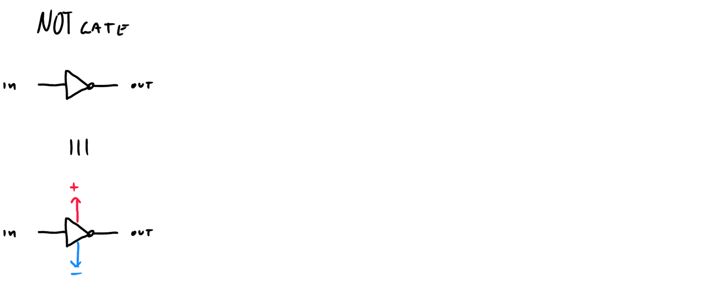

## Controlled switch in a circuit

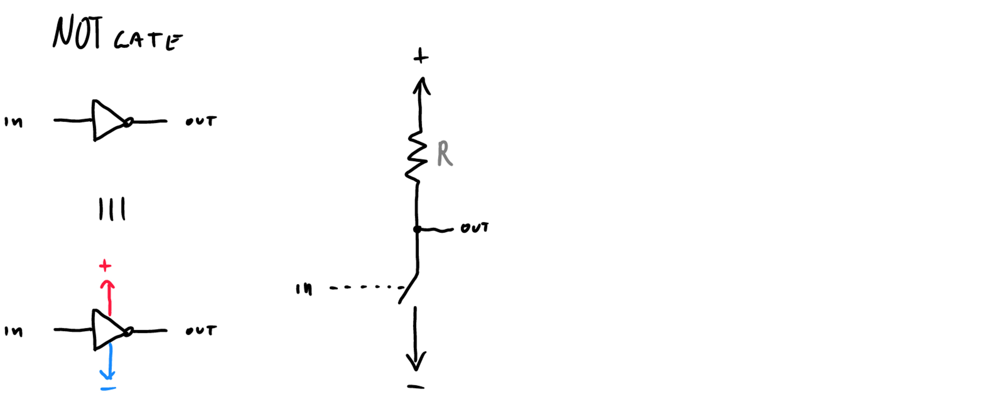

## Controlled switch in a circuit

## Controlled switch in a circuit

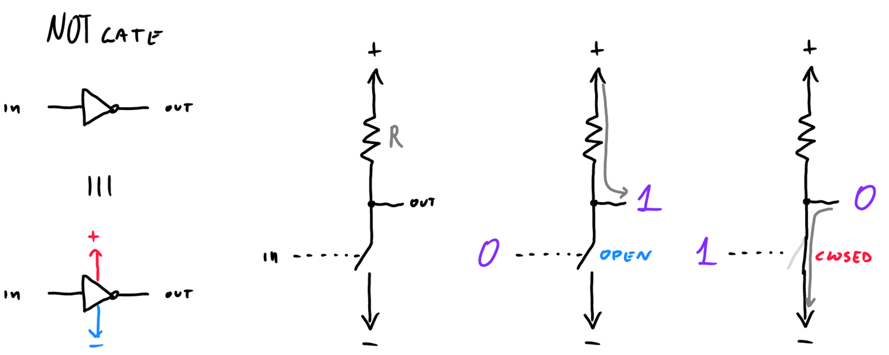

## Early technologies: Relays

- **Mechanical relays**
  - Controlled by electromagnets
  - Early computers used relays for logic operations

## Early technologies: Relays

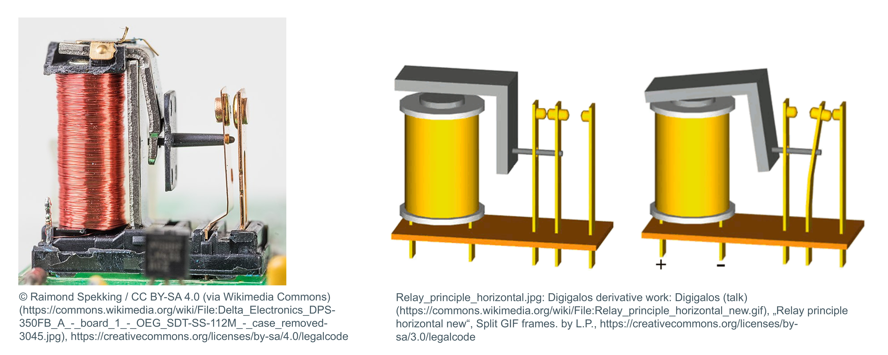

## Early technologies: Relays

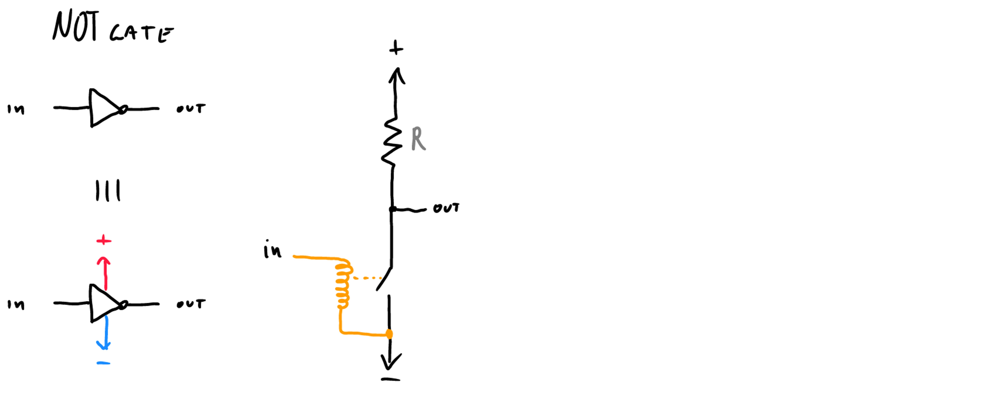

## Early technologies: Relays

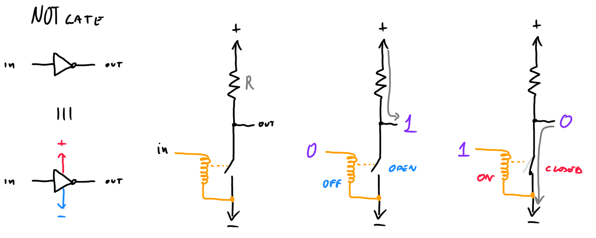

## Early technologies: Relays
- **Advantages**
  - Easy to build
  - Support high loads

- **Disadvantages**
  - Slow switching speed
  - Prone to mechanical wear
  - Loud

## Early technologies: Vacuum tubes

- **Vacuum tubes**
  - Used thermionic emission to control current flow

- **Acts as a controlled switch**

## Early technologies: Vacuum tubes
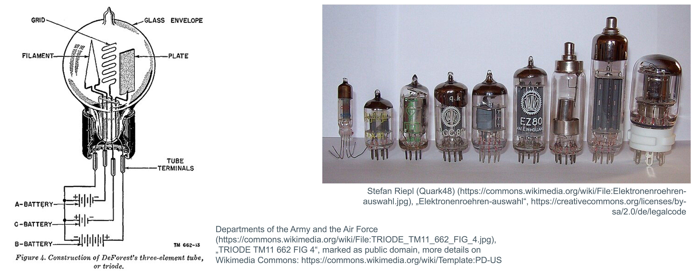

## Early technologies: Vacuum tubes
- **Advantages**
  - No moving parts
  - Faster than relays

- **Disadvantages**
  - Bulky and fragile
  - High power consumption
  - Excessive heat generation

## EINAC (1946)
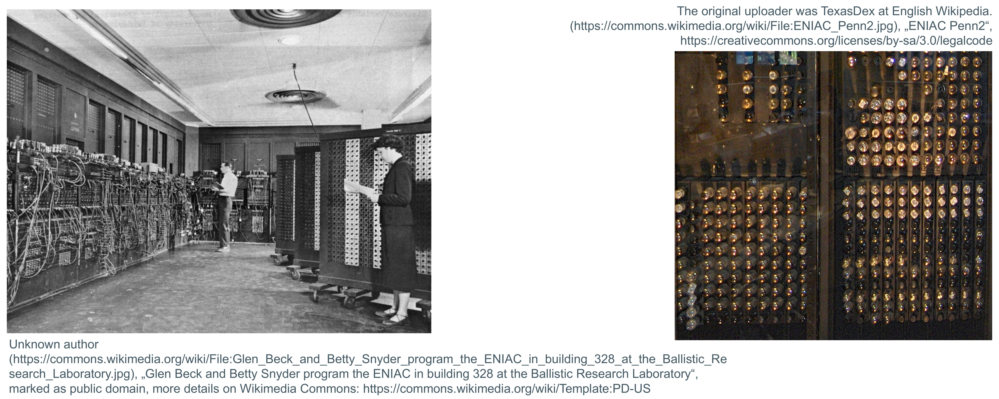

## Transition to solid-state devices

- **The need for improvement**
  - Relays and vacuum tubes were not scalable
  - High power and size limitations
- **Solution** 
  - Solid-state devices transistors
  - Smaller, faster, cheaper, and more reliable

## Transition to solid-state devices
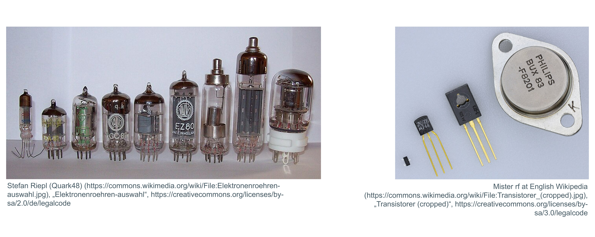

#   A brief history of the transistor

## The point-contact transistor

- **The first transistor**
 
- **Bell Labs (1947)**
  - by John Bardeen, Walter Brattain, and William Shockley
 
- **Goal** 
  - Replace vacuum tubes with a solid-state solution

## The point-contact transistor
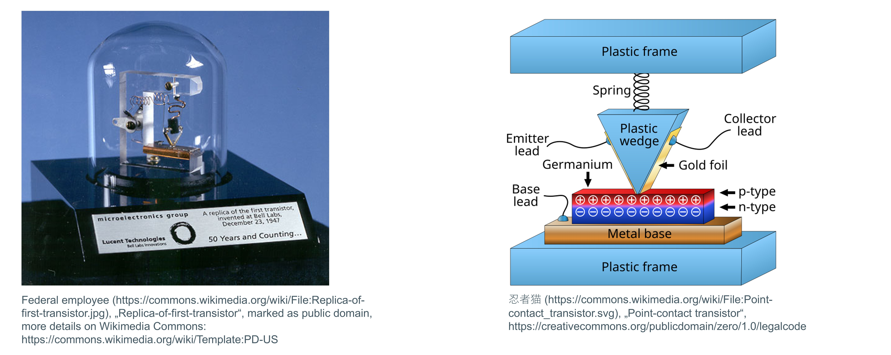

## The point-contact transistor

- **Structure**: Germanium crystal with two gold contacts
- **Functionality**: Amplified electrical signals
- **Limitations**: Fragile and difficult to manufacture

- **The science behind it was now demostrated!**

## The Bipolar Junction Transistor (BJT)

- **Bell Labs (1948)**
  - by William Shockley
- **Structure**: Three semiconductor layers
- **Amplifies a current**
- **Two types**: (NPN or PNP)
- **Advantages**: More robust and manufacturable than point-contact transistors
- **Applications**: Radios, early computers, and amplifiers

## The Bipolar Junction Transistor (BJT)

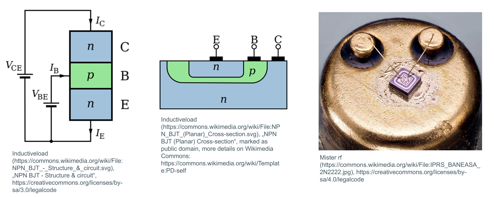

## Transition from Germanium to Silicon

- **Germanium was initially used but had limitations**
  - Unstable at high temperatures
  - Stability means maintain its properties and performance at different temperatures
- **Silicon emerged as the better material**
  - Abundant and thermally stable
- **First silicon transistor** 
  - 1954 by Texas Instruments

## The Metal-Oxide-Semiconductor Field-Effect Transistor (MOSFET)

- **Bell Labs (1959)**
  - by Mohamed Atalla and Dawon Kahng
- **Structure**: More later...
- **Advantages**
  - Scalable for miniaturization
  - Low power consumption

## The Impact of the MOSFET

- **Enabled the development of integrated circuits (ICs)**
 
- **MOSFETs are the foundation of:**
  - Microprocessors
  - Memory chips
  - Digital logic circuits
  - ...

## The impact of the MOSFET

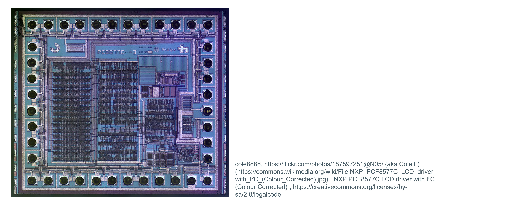

## The Integrated circuit revolution

- **First ICs contained only a few transistors**
- **Moore's Law (1965)**
  - Predicted the doubling of transistors on a chip every two years
 
- **1971**: Intel 4004 (First microprocessor)
  - 2,300 transistors
- **2020s**: Modern processors
  - Billions of transistors

## The Integrated circuit revolution

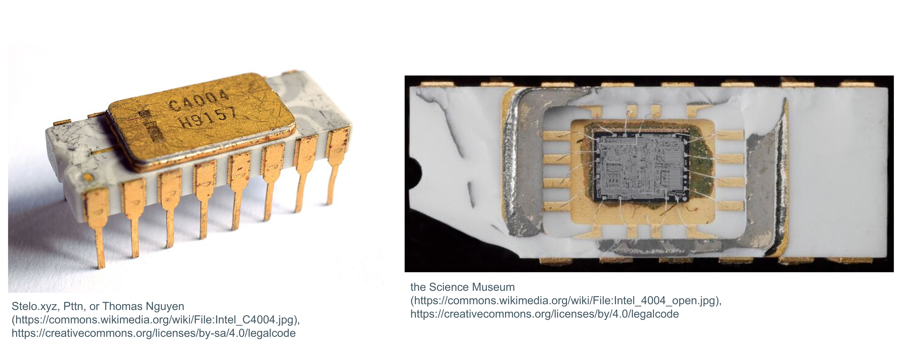

## The Integrated circuit revolution
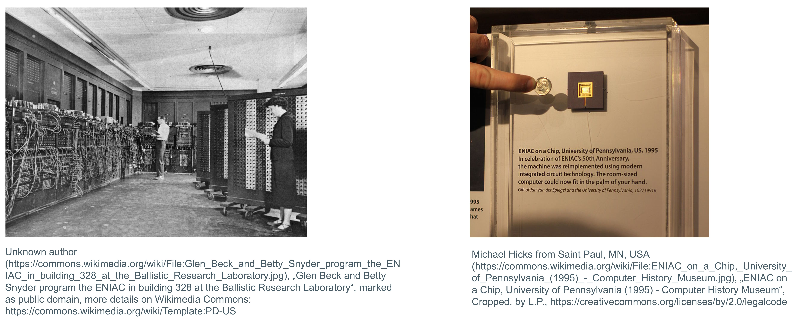

## FinFET and 3D transistors

- **Introduced for sub-20nm technologies**
  - FinFET (2010s)
  - Gate-All-Around Transistors (2020s)

## Timeline summary

1947 --> **Point-Contact Transistor**: First working transistor
 1948  --> **BJT**: Improved, smaller, producilble
 1959  --> **MOSFET**: Modern IC technology
 2010s -> **FinFET**: Sub-20nm technology
 2020s -> **Gate-All-Around Transistors**

#   The MOSFET transistor

## Generalities

- **Metal-Oxide-Semiconductor Field-Effect Transistor (MOSFET)**
  - Most widely used transistor type today
 
- **Advantages**
  - High input impedance
  - Low power consumption
  - Scalability for ICs

## Generalities

- **Two Types**
  - NMOS: Uses electrons as charge carriers
  - PMOS: Uses holes as charge carriers

- **Pins**
  - **Gate**: Controls current flow between Source and Drain
  - **Source**: Starting point of current flow
  - **Drain**: Endpoint of current flow
  - **Substrate (Body)**: The semiconductor base material (**omitted**)

## Symbols

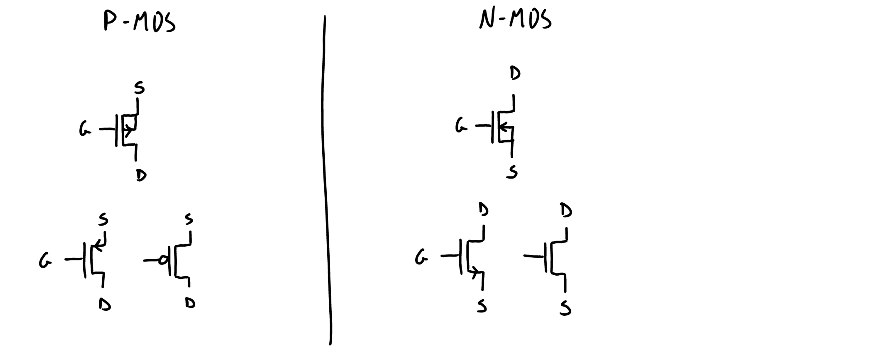

## MOSFET Structure

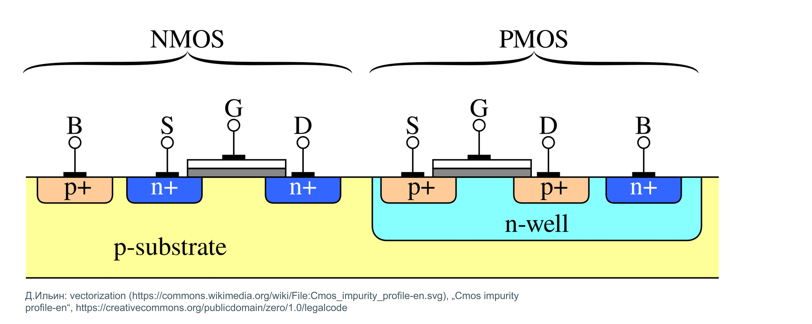

## Working basic principle

- **Voltage at the Gate**
  - Controls a channel between Source and Drain
 
- **Key Mechanism**
  - Gate voltage creates an electric field, inducing a conductive channel

## Working basic principle

 **Blackboard**

## MOSFET regions of operation

1. **Cutoff**
   - $V_{GS} < V_{th}$: No current flows
2. **Linear (Ohmic)**
   - $V_{GS} > V_{th}, V_{DS} < V_{GS} - V_{th}$: Current flows   proportionally to $V_{DS}$
3. **Saturation**
   - $V_{GS} > V_{th}, V_{DS} > V_{GS} - V_{th}$: Current is constant

$V_{th}$ is the Gate  threshold voltage needed for conduction

## MOSFET regions of operation

1. **Cutoff**
   $I_D = 0$
2. **Linear (Ohmic)**
   $I_D = k \cdot \left( V_{GS} - V_{th} \right) \cdot V_{DS}$
3. **Saturation**
   $I_D = \frac{k}{2} \cdot \left( V_{GS} - V_{th} \right)^2$

$k = \frac{\mu_n C_{ox} W}{L}$ : Process and geometry-dependent constant

## MOSFET transfer characteristic

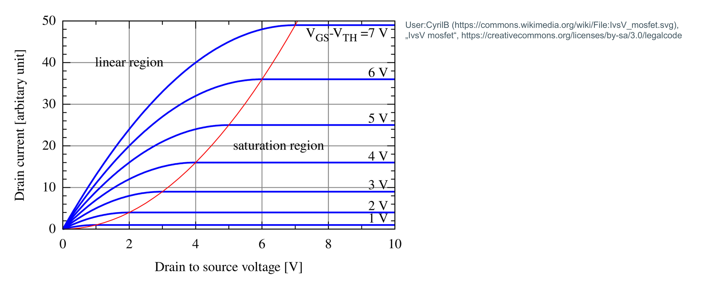

## Capacitance in MOSFETs

- **Reason**
  - Proximity of components where there is a potential difference
 
- **Effect**
  - Limits switching speed

## Capacitance in MOSFETs

 **Blackboard**

## Leakage in MOSFETs
- **Subthreshold leakage**
   - Current flows even when $V_{GS} < V_{th}$
- **Gate leakage**
   - Caused by tunneling through the thin oxide layer
- **Other leakages**
   - Anywhere there is a potential difference

## Leakage in MOSFETs
 **Blackboard**

#   The inverter ('NOT' gate)

## The NMOS inverter

- Single NMOS transistor with a pull-up resistor
 
- **Operation**
  - Input LOW: Output HIGH (resistor pulls up)
  - Input HIGH: Output LOW (NMOS conducts)

## The NMOS inverter

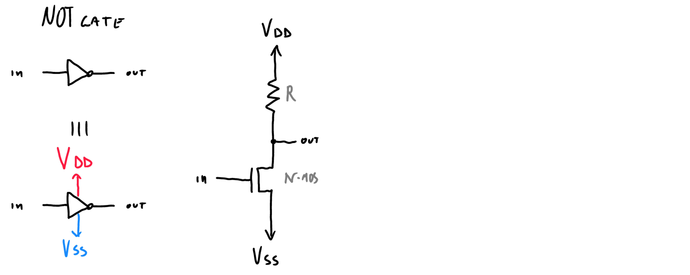

## The NMOS inverter

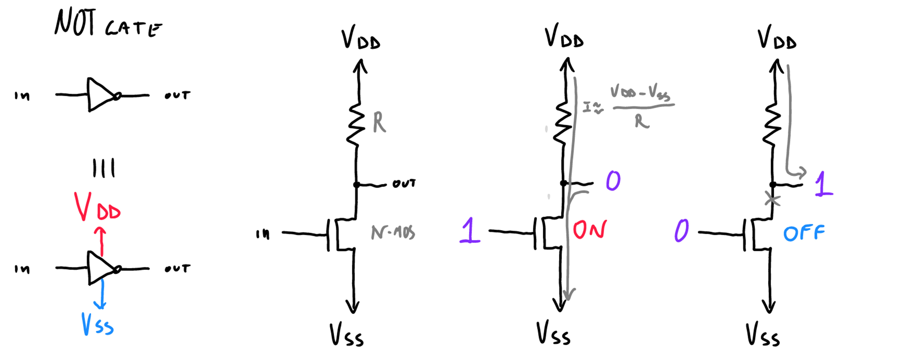

# The NMOS inverter

- **High power consumption in the 'output LOW' state**
  - Current flows through the resistor
 
- **Slower operation due to resistive pull-up**

## The CMOS inverter

- **Complementary MOS (CMOS)**
  - Combines NMOS and PMOS transistors
 
- **Operation**
  - Input LOW: PMOS ON, NMOS OFF → Output HIGH
  - Input HIGH: NMOS ON, PMOS OFF → Output LOW

## The CMOS inverter

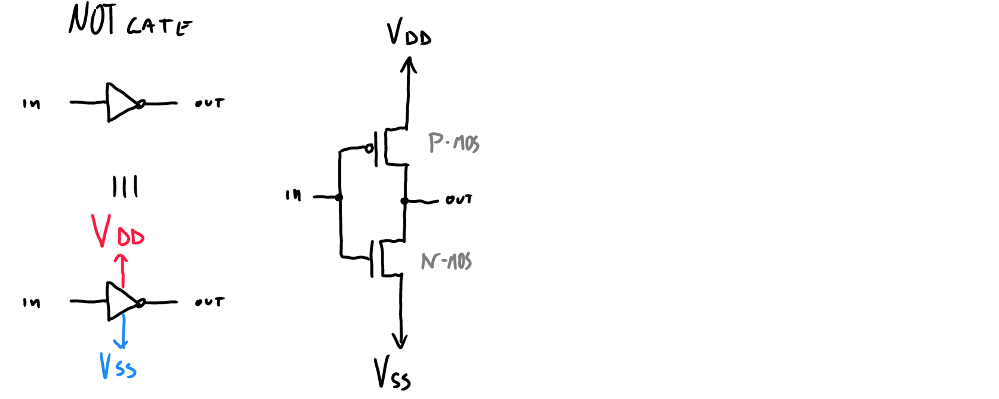

## The CMOS inverter

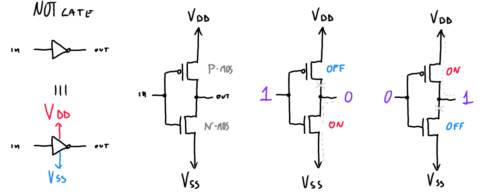

## The CMOS inverter

- **No static power dissipation**
  - Only consumes power during switching
 
- **Fast switching**
  - Limited by gate capacitances

## Fabricating a CMOS inverter in silicon

## Fabricating a CMOS inverter in silicon

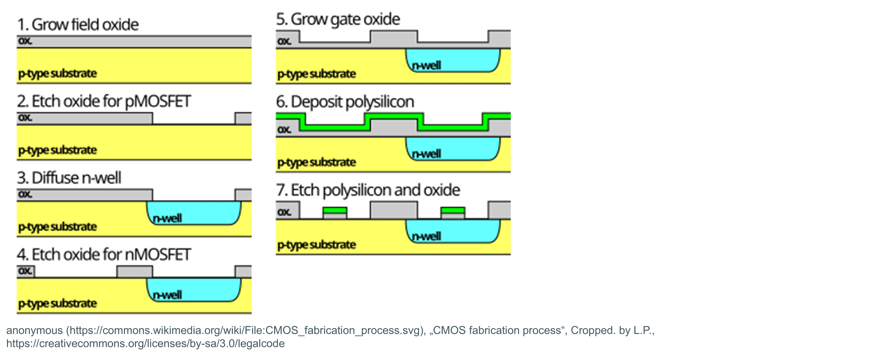

## Fabricating a CMOS inverter in silicon

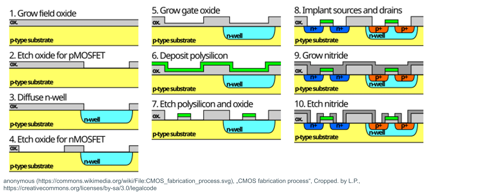

## Fabricating a CMOS inverter in silicon

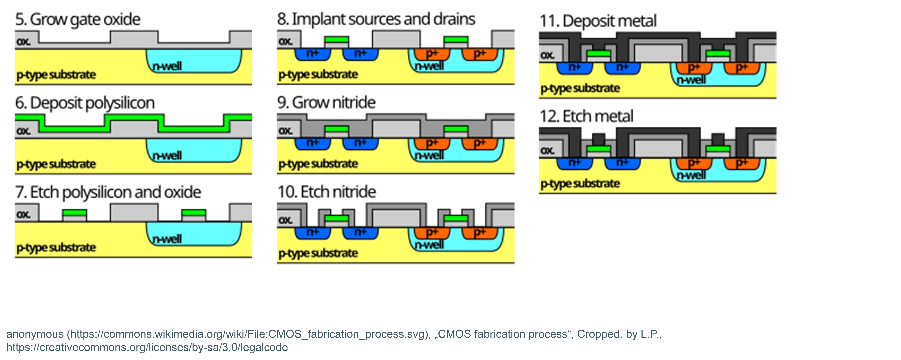

#    Other gates

## Building logic gates with CMOS

- **NAND Gate**
  - Series NMOS and parallel PMOS transistors

- **NOR Gate**
  - Parallel NMOS and series PMOS transistors

## Building logic gates with CMOS (NAND)

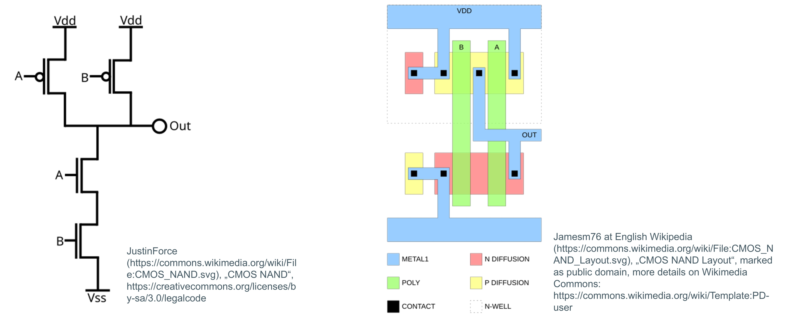

## Standard cells and custom circuits

- **Standard Cells**
  - Predefined layouts for basic gates (NAND, NOR, etc.)
  - Simplify chip design
 
- **Custom Circuits**
  - Tailored for specific applications

#  End
  **Laboratory** 
  - All exercises form [SiliWiz](https://tinytapeout.com/siliwiz/)
  - See Laboratory 2 file
  - Feel free to skip some if you are confident witht the topic

