<!-- headingDivider: 3 -->

# **Tool flow and course project**

**Luca Pezzarossa and Martin Schoeberl**

## Agenda

1. Tool flow
2. Course project

## Reading/reference material
- Lecture slides (also available as PDF in DTU-Learn)
- [OpenLean 2 Documentation](https://openlane2.readthedocs.io/en/latest/)* 
   
\* This is a large documentation from whih this slide set is based upon, you do not need to read it all. Reference to it when needed.

#   Tool flow

## Introduction

- Step-by-step overview of the **OpenLane2** ASIC design flow, from **RTL** to **GDSII**
 
- Gives an intuitive understanding of each stage in the process
- Helps getting an understand of each step basics
 
- More in-depth exploration is up to you, if needed

## OpenLane2 ASIC design flow

- OpenLane2 is an open-source toolchain for ASIC design
  - Automates the process from RTL to GDSII for tapeout
  - Ensures manufacturability with verification steps
  - Uses open-source tools (e.g., Yosys, OpenROAD, and Magic)

## OpenLane2 ASIC design flow

## OpenLane2 ASIC design flow
 
 

Explore "The OpenLane Infrastructure" image at this [link](https://github.com/efabless/openlane2/blob/main/Readme.md)

## Input preparation

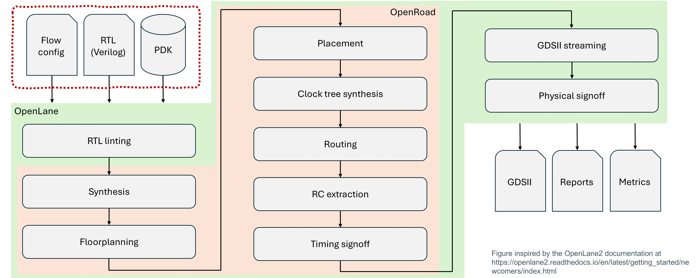

## Input preparation

- **Flow configuration (.json file)**: Defines key settings and constraints
- **Verified RTL (.v files)**: Hardware description of the design
- **PDK (process design kit)**: Defines fabrication rules and technology parameters

## RTL linting

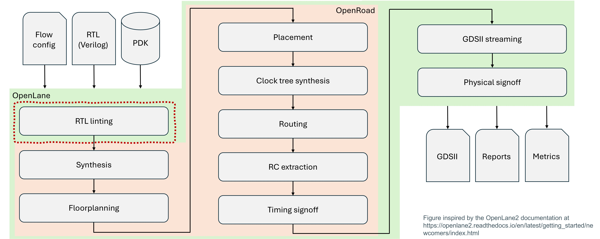

## RTL linting

- **Tools used:** Yosys and Verilator
- Checks for syntax errors and design rule violations
- Ensures coding style and synthesis compatibility

## RTL linting

- Identifies undeclared signals, ambiguous constructs, cobinational loops, and unintended latches
- Verilator also detects simulation mismatches and potential race conditions (combinational loops)
 
- Linting is important
  - Fixing linting issues early saves time in later stages

## Synthesis

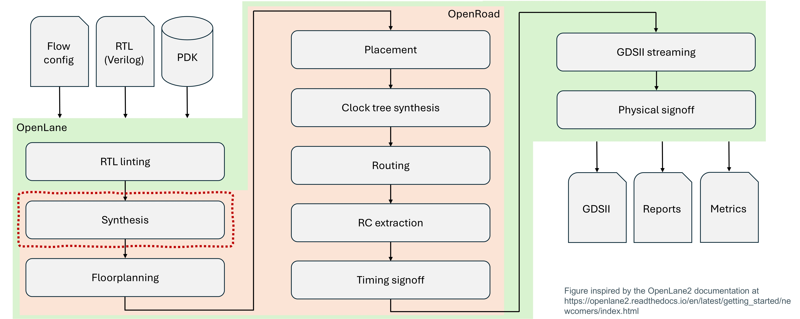

## Synthesis

- **Tools used:** Yosys
- Converts RTL to a gate-level netlist
- Optimizes logic using Boolean minimization techniques (ABC?)

## Synthesis

- Transforms high-level design into standard cell logic
- Technology mapping ensures compatibility with PDK cells
- Optimization aims: 
  - Reduces area
  - Speed
  - Power consumption
  - ...
- Preliminary STA (OpenSTA) is done here

## Floorplanning

## Floorplanning

- Defines placement of functional blocks on the chip
- Establishes **power distribution network (PDN)**
- **Allocates** space for standard cells, macros, and IO pads

## Floorplanning

- Proper floorplanning minimizes wire congestion and signal interference
- PDN ensures stable power delivery across the design
- Efficient placement improves routability and timing

- Floorplanning is not placement
  - Operates at a more coarse level

## Placement

## Placement 

- **Global placement:** Determines approximate locations of cells
- **Detailed placement:** Adjusts cell positions for compliance (more later)
- **Optimization:** Improves routing and timing

- Placement:
  - Uses "force-directed" placement and "simulated annealing"
  - Ensures DRC compliance and timing-driven placement

## Clock tree synthesis (CTS)

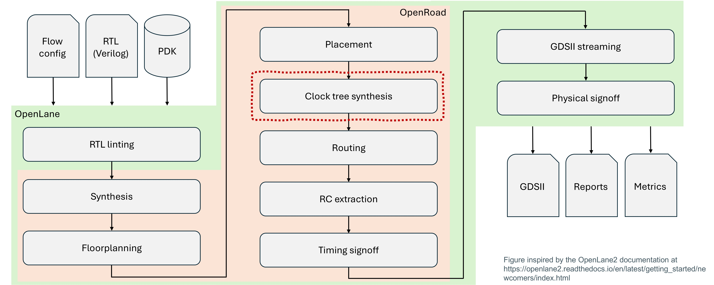

## Clock tree synthesis (CTS)

- Distributes a balanced clock signal across the design
 
- Reduces **clock skew** (timing variations in different flip-flops)
 
- Inserts buffers and inverters to optimize clock delivery

## Routing 

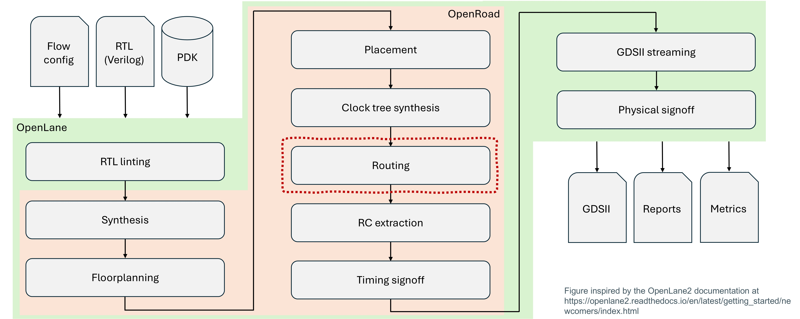

## Routing 

- **Global routing:** Determines interconnect paths
 
- **Detailed routing:** Assigns metal layers and tracks

## Routing

- Uses algorithms like A* search and rip-up-and-reroute
- Ensures metal layer assignments meet DRC constraints
 
- Driven by:
  - Minimize wire capacitance and resistance
  - Minimize lenght (timing)

## Routing

- Also incudes:
  - Diode insertion
  - Antenna repairs
  - Row filling (power continuity, robustness)

## RC extraction

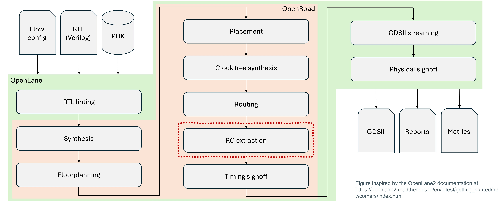

## RC extraction

- Extracts **resistance (R)** and **capacitance (C)** from routing
- Models parasitic delays for accurate timing analysis
 
- **Aim:**
  - Parasitic effects impact performance and power consumption
  - Extracted values help refine timing estimates before signoff
  - Ensures signal integrity by modeling real-world effects

## Timing signoff

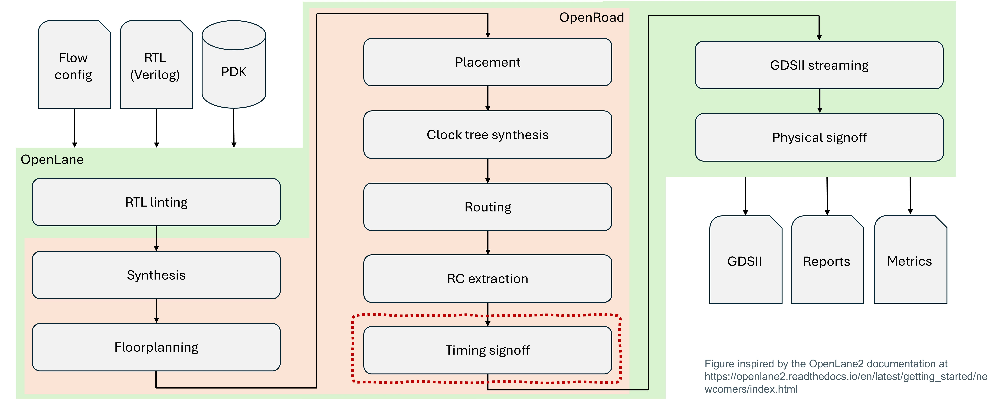

## Timing signoff

- **Tool used:** OpenSTA (PrimeTime?)
- Performs **static timing analysis (STA)**
- Checks for **setup and hold violations**

- **Aim:**
  - Computes worst-case delays across different paths
  - Ensures signals meet timing constraints under process variations
  - Timing issues can lead to functional failures

## GDSII streaming

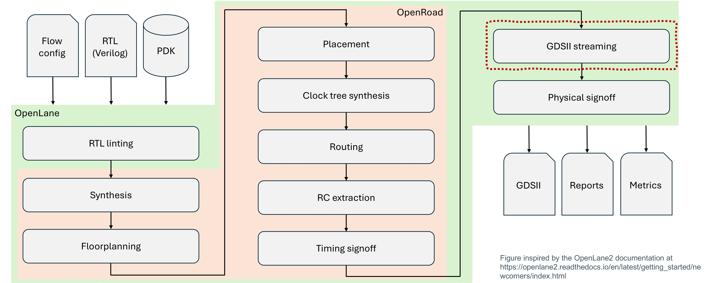

## GDSII streaming

- **Tools used:** Magic and KLayout
- Converts the final layout into **GDSII format***
 
- GDSII is the standard format for semiconductor fabrication
  - Contains detailed geometric data for photolithography
  - Final verification ensures manufacturability
  - Sent to foundries for tapeout

## Physical signoff

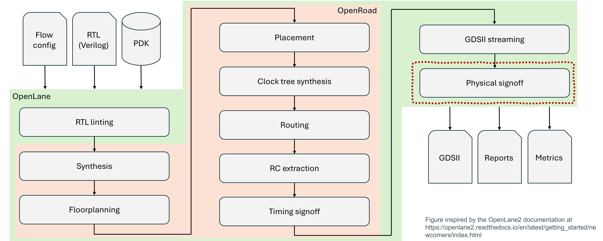

## Physical signoff

- **Tools used:** Magic, KLayout, and Netgen
- **Design rule check (DRC):** Ensures compliance with fabrication rules
 - DRC ensures metal layers, vias, and spacing follow PDK constraints
- **Layout vs. schematic (LVS):** Verifies layout matches netlist
  - LVS compares the layout against the original circuit description

## Final outputs

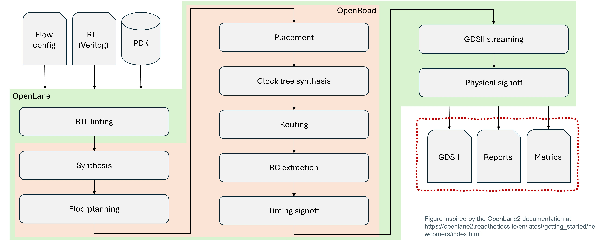

## Final outputs

- **Reports:** "Log" from all the steps
- **GDSII file:** Fabrication submission
- **Design metrics:** Area utilization, timing, power?

## SDF simulation

## SDF simulation

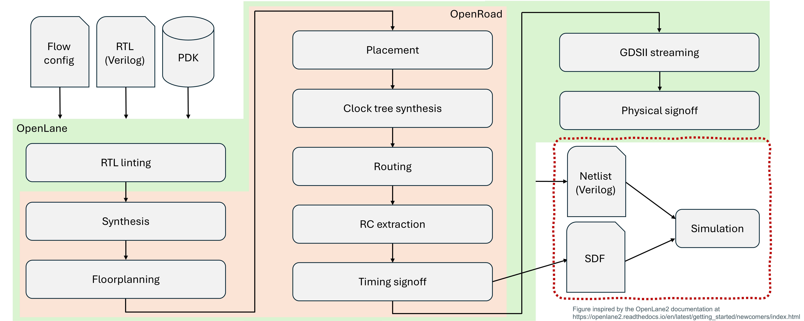

## SDF simulation

- **Standard delay format (SDF) simulation**
  - Ensures post-layout timing matches expected behavior

- **Aim:**
  - Models real-world signal delays post-routing
  - Verifies final design meets specifications
  - Prevents unexpected failures in silicon

## Summary

- OpenLane2 is an open-source toolchain for ASIC design
  - Automates the process from RTL to GDSII for tapeout
  - Ensures manufacturability with verification steps
  - **Many many steps** are involved

#   Course project

## Session aim

- **Project information**
  - Goals, scope, deliverables, technicalities
- **Understanding the system-on-chip (SoC) architecture**
  - Explore core components and their interactions
- **Group forming**
  - Team and task selection (lab session)
- **Coordination and workflow**
  - GitHub collaboration, CI, and tapeout plan

## Project goals

- Apply concepts, tools, and techniques from the course
- Design, implement, verify, and prepare a collaborative medium-sized digital design for tapeout
- Use open-source tools throughout
- **Have some fun** while learning

## Group formation

- Groups of **3 people** (groups of 2 allowed but not preferred)
- Register groups in DTU-Learn
- Align expectations early (availability, work habits, goals)
- If needed, contact Luca for group formation assistance

## Deliverables

- **Project report** 
- **Contribution to the GitHub repository**
- **Contribution to README/documentation**
- **Deadline**: TBD (end of the course)

## Assessment criteria

- **Relevance and complexity**
  - Does the design address a meaningful challenge?
- **Correctness**
  - Does the implementation function as intended?
  - Are there any critical design flaws?
- **Optimization**
  - Area and performance efficiency considerations
  - Power consumption and design trade-offs

## Assessment criteria

- **Verification quality**
  - Comprehensive testbenches and accurate simulations
  - Pre-synthesis and post-synthesis validation
 
- **Testing quality**
  - Functional FPGA testing
  - DRC and layout verification

## Assessment criteria

- **Completion**
  - Is the design ready for tapeout?
 
- **Report quality**
  - Clear documentation of methodology, challenges, and results

## Tapeout plan

- **Via efabless Open MPW shuttle (ChipIgnite)**
- **Tapeout date**: April 21, 2025 (another one in June)
- **Exploring Tiny Tapeout for experimental work**

## Project overview

- We aim for a common project: a simple system-on-chip (SoC)
- Includes CPU, memory, and IO
- Hosted on GitHub: [DTU-SoC-2025](https://github.com/os-chip-design/dtu-soc-2025)
- Send your GitHub ID to Luca or Martin for access
- Real tapeout planned

## Core components

- **CPU**: Wildcat RISC-V
- **Memory**: Internal memory?, caches?, SPI-based flash and RAM
- **Interfaces**: SPI (with normal/quad switch?)

## Core components

- **Peripherals**:
  - VGA (character display)
  - Keyboard
  - Serial port
  - GPIO
  - Timers
  - PWM
  - More?

## System

 Blackboard + dicussion

## Project elements

**Each student group must choose an element to work on:**
- CPU
- Cache
- Memory controller
- SPI interface
- VGA display
- Keyboard interface

## Project elements

- Serial port
- GPIO and timer
- Accelerator
- Special IOs (PWM, etc.)
- Integration
- Testing and verification
- Toolchain/Tapeout
- Exploring memories

## System-on-chip: CPU

- Based on Wildcat RISC-V
- Implements basic instruction set with optional extensions
- Integration with cache and memory controller

## System-on-chip: cache/memory system

- Memory and addressing system of the CPU
- Memeory mapped IOs
- Include caches?

## System-on-chip: memory controller

- SPI-based flash and RAM access
- Off-chip PMOD
- Quad-SPI?

## System-on-chip: peripherals

- **VGA**: Character-based display
- **Keyboard**: Protocol?
- **Serial port**: We have the UART, we just need to connect it
- **GPIO, PWM, timers**: General purpose input/output and basic devices

## Integration

- Ensuring all system components communicate efficiently
- Managing interconnects, clock domains, and data flow
- Integrating with Caravel for tapeout

## Workflow

- **All work is open-source**
 
- **Collaboration on GitHub**:
  - No private code copies
  - No branches (unless approved)
  - GitHub issues for task tracking

## Workflow

- **Continuous integration (CI)**:
  - Common in software, rare in hardware
  - We will implement it
  - Catch errors early
  - Use GitHub Actions
  - Investigate running tapeout flow on GitHub
 
- **One group could work on this**

## Testing and verification

- **Simulation**: Pre-synthesis functional validation
- **Post-synthesis and post-layout simulations**
- **FPGA testing**: Running design on real hardware
- **Design rule check (DRC) and layout verification**
 
- **One or 2 groups could work on this**

## Suggested timeline
- **Week 4**: Form groups, select project, open discussion
- **Week 6**: Finalize desing concept, define specs, align between groups
- **Weeks 7-11**: Develop design, run simulations, initiate physical design
- **Weeks 12-13**: Finalize physical design, complete DRC/LVS checks, prepare for submission

- **We could finish earlier** for the April tapeout

## End - Lecture 4
- **Laboratory** 
  - **Continue the discussion** on the project
  - **Form and register groups** based on interests and expertise
  - **Select a task** related to the project (e.g., CPU, memory, peripherals, integration, testing)
  - **Start working** by setting up the development environment and perform initial design steps
  - **Sign up in the GitHub repo**

