<!-- headingDivider: 3 -->

# **SoC, Interconnects, and NoCs**

**Luca Pezzarossa and Martin Schoeberl**

## Agenda
1. **System-on-Chip**
   - Interfaces for custom hardware
   - SoC architectures / Design priciples

2. **Interconnects**
   - Traditional bus architectures
   - Bus standards and protocols
   - AXI Bus Protocol

3. **Networks-on-Chip overview**

## Reading/reference material
- This slide set
- Bus documentation (targeting the bus you use)

#    System-on-chip

## System-on-Chip (SoC)

## System-on-Chip (SoC)

- Combine multiple functional blocks in a single chip
  - Microprocessors  
  - Memory  
  - I/O devices  
  - Dedicated co-processors, hardware accelerators  

- General purpose computing + various highly specialized functions  
  *(e.g., filters, decoders, etc.)*  

## System-on-Chip (SoC)

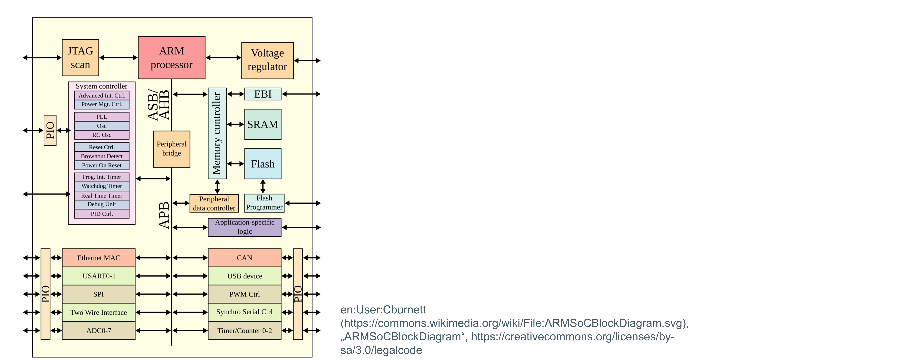

## System-on-Chip (SoC)

- A SoC is often for domain-specialized computing  
  - Example: Smartphones, video processing, high-speed network  
- Specialization ensures the right processing efficiency and lower power consumption  
- Flexibility ensures reusable solutions that work across multiple applications  

## Important units

- **Compute and control:** Microprocessor(s)  
- **Communication:** System-wide inteconnects
  - Data transfer: read/write operations from a specific address  
  - Each component has a particular "address range" in memory (memory map)
  - Might include bridges
- **Peripherals and I/O**

## Interfaces for custom hardware

- Custom harware is often ingrate in a SoC
- HW accelerator / Co-processor
 
- How can it be integrated?

## Interfaces for custom hardware
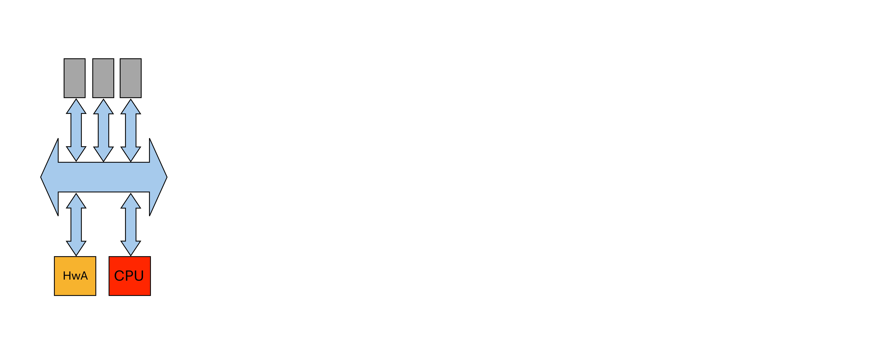

## Interfaces for custom hardware

- **Integrate a FSMD as part of a standard peripheral to a system bus**  
  - Communication is handled using read/write memory to/from dedicated addresses  
  - **Good:** Simple operations supporting a variety of custom hardware  
  - **Bad:** The bus becomes a bottleneck under heavy communication  

## Interfaces for custom hardware
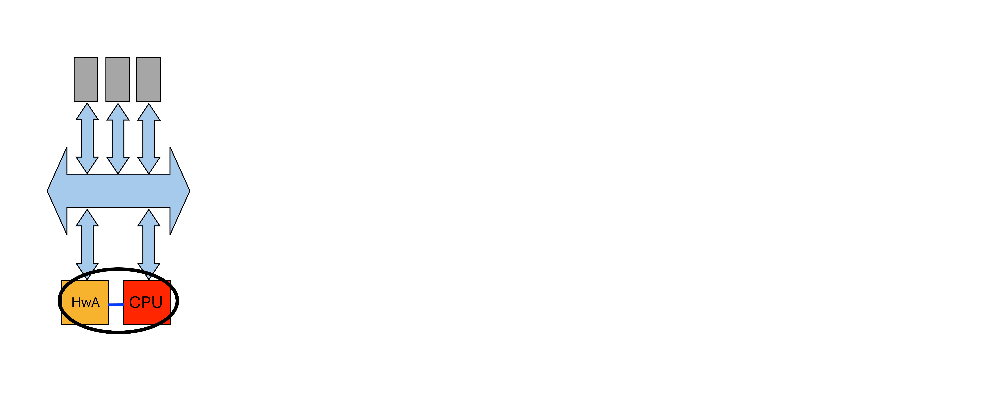

## SoC interfaces for custom hardware

- **Use a local bus or connect directly to the FSMD**  
  - Communication takes place via a dedicated bus or interface  
  - **Good:** High bandwidth and low latency  
  - **Bad:** The microprocessor must support additional instructions to communicate over this interface  

## Interfaces for custom hardware
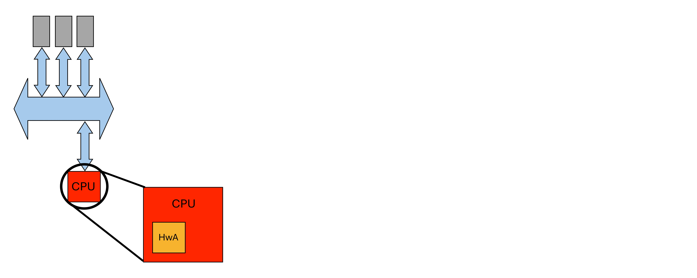

## Interfaces for custom hardware

- **Integrate FSMD in the microprocessor**  
  - The instruction set is extended with new instructions to operate the hardware  
  - Communication uses the processor register file  
  - **Good:** Very high bandwidth  
  - **Bad:** Bottlenecks in the processor will now also be bottlenecks for the extra hardware  

## Which solution is better?

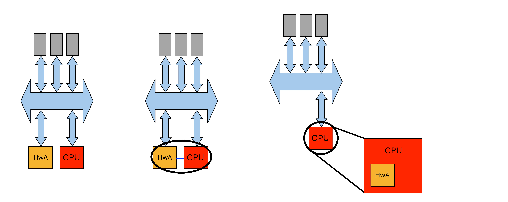

## Which solution is better?

- No best solution  
- Trade-offs:  
  - Bandwidth  
  - Hardware complexity  

## Properties of SoC architectures

- Four design principles:  
  1. Heterogeneous and distributed data processing  
  2. Heterogeneous and distributed communication  
  3. Heterogeneous and distributed memory  
  4. Hierarchical control  

## 1. Heterogeneous and distributed data processing

- Task level parallelism:  
  - Multiple independent tasks executed in parallel  
  - Each calculation unit is specialized for a particular function  
  - Key to an efficient chip  

## 2. Heterogeneous and distributed communication

- **Bus** = critical resource  
- **Bandwidth is plentiful!**
  - **10mm² processor in 90nm 6-metal layers**  
  - 40 TB/s achievable bandwidth  

- Take advantage of high communication bandwidth using **network-on-chip** and **bridged buses**  

## 3. Heterogeneous and distributed memory

- Different compuing uinit have dedicated memories:
  - Processors contain local memories, caches, etc.  
  - Co-processors may use local register files  
  - Accelerators may use registers and memories
 
- "Memory wall": Performance limited by memory speed  
- Multiple copies must be kept updated

## 4. Hierarchical control

- SoCs operate as a single unit where all components synchronize eventually  
- Each component coordinates its own work
- May uses a "RISC" processor for global coordination  

#   Interconnects

## Bus

- Communication path that links two or more devices  
- Classic bus: "broadcast"  
- An n-bit data bus has n separate single-bit channels  

## Classic bus lines

- **Data lines:** Carry data  
  - Data width affects performance 
  - E.g., 8, 16, 32, 64 bits
- **Address lines:** Identify data source and destination  
  - Address width determines the maximum addressable space 
  - E.g., 16-bit bus → 64K address space  
- **Control lines:** Define transfer type 
- E.g., read/write  

## Classic bus lines

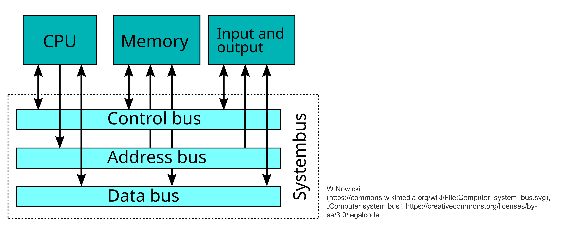

## Typical bus standard specifications

- **Signal wires:** 
 - Address, data, control *(read/write, arbitration)*  
- **Transactions:**  
  - Read/write: byte, word, block  
- **Protocols:**
  - How to carry out a transaction  

## Typical bus standard specifications
- **Electrical specifications (old):**  
  - Voltage levels  
  - Allowed signal load, driver strength  
- **Other considerations:**  
  - Synchronous vs. asynchronous operation  
  - Flow control *(data producer vs. consumer)*  
  - Serial vs. parallel address/data transfer  
  - Topology *(shared wires vs. switched connections)*  

## The BUS as an IP-core

- The **BUS** is an IP-core with multiple ports  
- Not just a collection of wires but an **active component**  

## The BUS as an IP-core

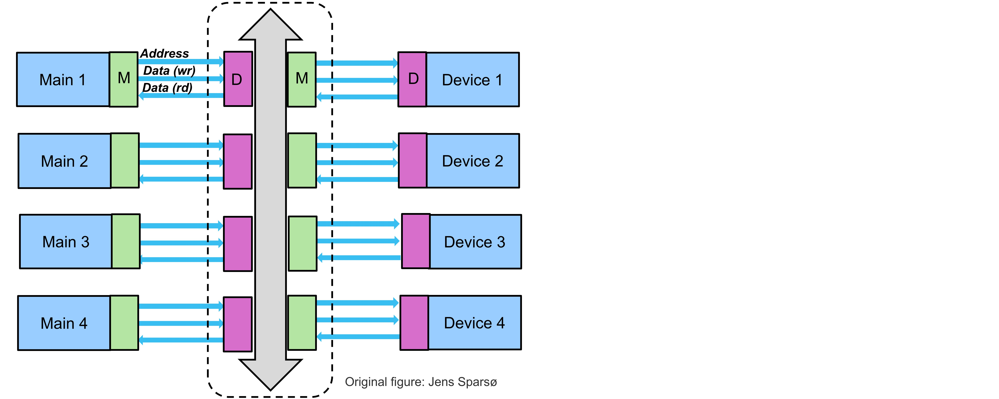

## The BUS as an IP-core

- Supports **modularity** and **IP block reuse**  
- **Standardized point-to-point interfaces** for IP blocks  
- Different **traditional/classic buses** can be wrapped inside a standardized BUS-core  

## AXI: Advanced eXtensible Interface

- Very commmon protocol nowdays
- Part of the ARM **Advanced Microcontroller Bus Architecture (AMBA)**  
- AXI4-Lite is a lighter version

## AXI: Advanced eXtensible Interface

- **Burst-based protocol**  
- Transactions contain **data, address, control** information  
- Transactions using channels
 
- Features:  
  - **Address issued ahead of data transfer**  
  - **Multiple outstanding transactions**  
  - **Out-of-order completion supported**  

## AXI: Advanced eXtensible Interface

- AXI4 and AXI4-Lite interfaces have **five** channels:  
  1. Read Address Channel  
  2. Write Address Channel  
  3. Read Data Channel  
  4. Write Data Channel  
  5. Write Response Channel  

## Handshake process

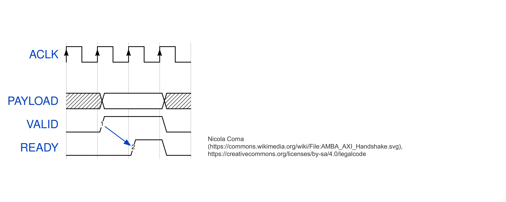

## Reading (channels)

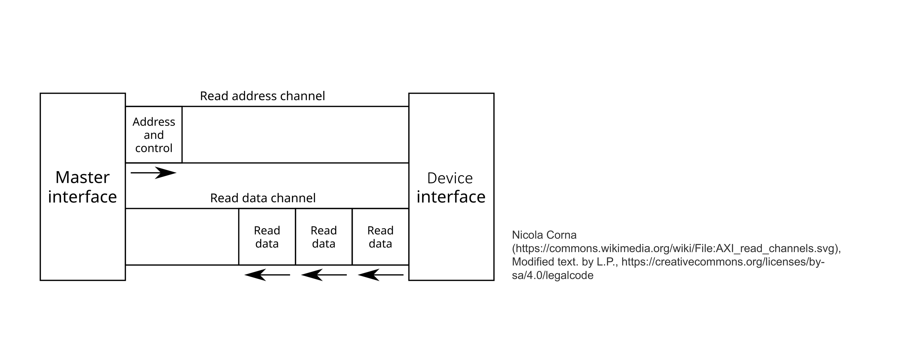

## Reading (timing diagram)

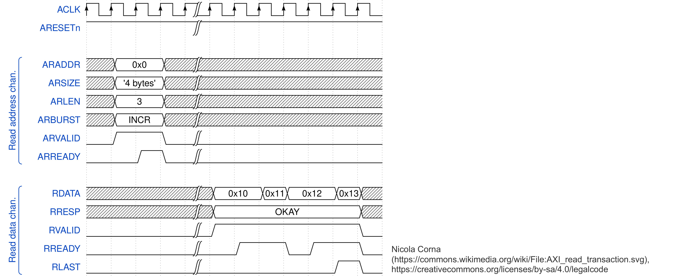

## Writing (channels)

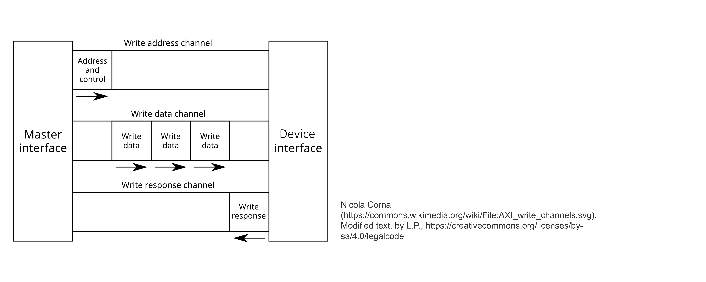

## Writing (timing diagram)
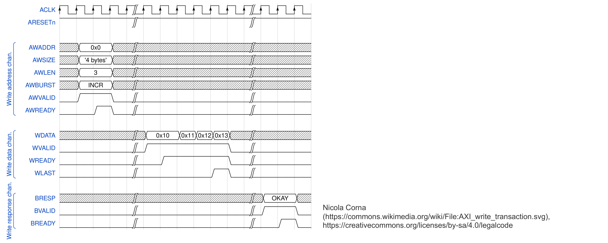

## Improved data transmissions

- **Transaction-splitting:** Splits bus transactions into multiple phases  
- **Pipelining:** Overlaps execution of transmission phases  
- **Burst mode:** Transfers multiple data objects from consecutive addresses in a single transaction  

## Multi-level bus architectures

- A single bus might not be sufficient for all devices  
- Some devices require high-speed, processor-specific bus interfaces  
- Too many devices on one bus can slow down communication  
- Common architecture:  
  - **Processor Local Bus**  
  - **Peripheral Bus**  
  - **Bridge**  

#   Networks-on-Chip overview

## Main idea of NoCs

- Create **dedicated channels** or **route packets** between processing cores  

- **Networks-on-chip** can be used instead of a "bus"  
- Implemented with **routers and network interfaces**  
- Allows **scalable** and **efficient** data transfer  

## A packet-switched NoC
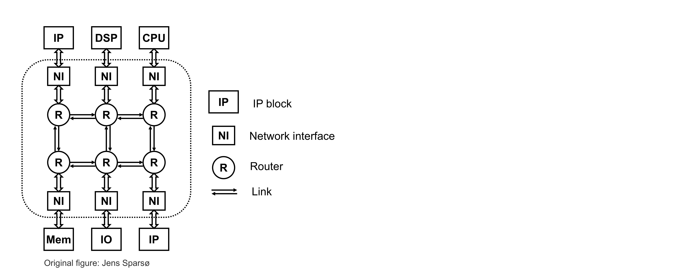

## A packet-switched NoC
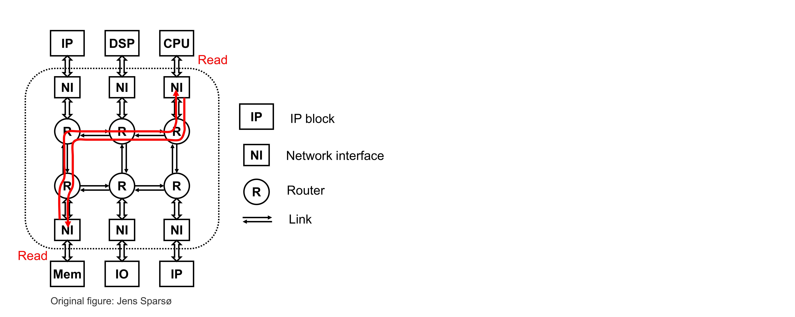

## NoC topologies

- **Mesh**  
- **(Binary) Tree**  
- **Torus**  
- **Ring**  
- **Irregular**  
- **Etc.**

## Motivations for NoC

- **Technology-driven**  
  - **Long wires** require repeaters  
  - Registers as repeaters → **pipelined wires**  
  - **Adding simple X-Y switching** → **pipelined mesh (NoC)**  

## Motivations for NoC
- **Design methodology**  
  - **Modular, plug-and-play design** using IP blocks and routing nodes  
  - **Scalable bandwidth** increases with the number of IPs  

## End - Lecture 6
- **Laboratory** 
  - **Work** on the project

- **Next week** 
  - Your project presentation
  - More information 
    - Announcements
    - README file

